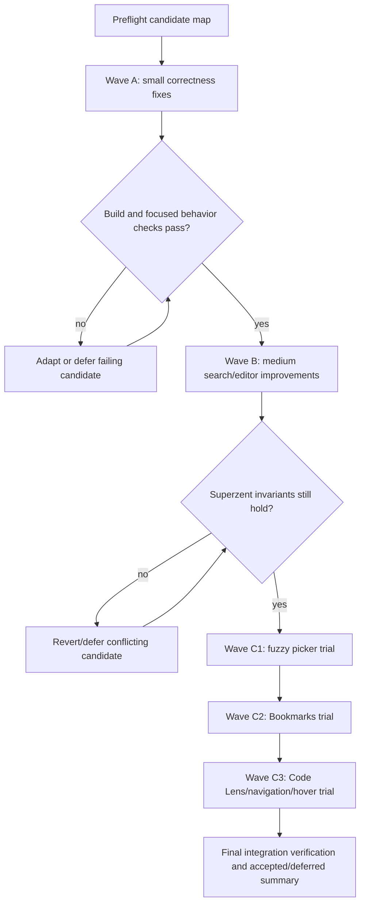

# Backport Upstream Editor and Search Improvements

## Overview

Selectively cherry-pick upstream Zed improvements that make Superzent's everyday editor, search, terminal, and picker experience better without merging the full upstream branch. The work is intentionally wave-based: land small correctness fixes first, then medium editor/search improvements, then trial larger feature backports that may be deferred if they conflict with Superzent's product model.

## Problem Frame

Superzent is based on Zed but has its own product constraints: a single-window workspace model, managed workspace behavior, Superzent-specific terminal agent wrappers, and a default build that keeps next-edit separate from the broader upstream hosted AI/chat stack. The current branch's merge-base with `upstream/main` is `be3a5e2c061823c5fa4de56e4eec58e68319a0ac` from 2026-03-18. Since then, upstream has useful editor/search fixes and features, but also a large agent/sidebar rewrite that should not be absorbed in this phase. (see origin: `docs/brainstorms/2026-04-23-upstream-sync-editor-search-requirements.md`)

## Requirements Trace

- R1. Use upstream commit or PR-level cherry-picks, not a full `upstream/main` merge.
- R2. Include both low-risk bug fixes and selected editor/search feature improvements.
- R3. Exclude broad upstream agent/sidebar/chat architecture rewrites from Phase 1.
- R4. Review any default-build AI, hosted model, ACP, or chat-surface touch against Superzent's `next_edit` / `full` feature split.
- R5. Apply small terminal/search/editor correctness fixes first.
- R6. Apply search and picker improvements that touch shared project/search infrastructure after the small-fix wave.
- R7. Evaluate larger feature backports separately: fuzzy picker matching, Bookmarks, Code Lens, and generic navigation overlays.
- R8. Defer Wave C candidates individually when persistence, settings, LSP, workspace, or build-feature conflicts are too high.
- R9. Cover replace/search correctness, stale project-search results, symbol picker UTF-8 safety, markdown-preview search, and non-ASCII replace-all hangs.
- R10. Cover editor folding, sticky headers, hover, completion undo, selection, formatting, block comments, Bookmarks, Code Lens, and navigation overlays when feasible.
- R11. Cover terminal input, focus, cursor, path detection, process cleanup, heredoc shell handling, and combining-mark fixes.
- R12. Confirm `fuzzy_nucleo` fits Superzent's current picker, workspace switcher, import-worktree, and managed workspace behavior before treating it as accepted scope.

## Scope Boundaries

- Do not merge all upstream changes.
- Do not pull upstream agent/sidebar/chat rewrites into this phase.
- Do not change the default Superzent build to include upstream hosted AI/chat behavior.
- Do not treat Bookmarks, Code Lens, `fuzzy_nucleo`, navigation overlays, or hover-delay settings as mandatory if they conflict heavily.
- Do not edit `.rules` or project policy files as part of this sync.

### Deferred to Separate Tasks

- Phase 2 chat/agent UI backports: handle message editor, thread view, draft, scroll, and ACP UI improvements in a separate planning/execution pass.
- Any broad ACP SDK or agent/sidebar model migration: evaluate separately because it overlaps with Superzent's agent tabs and managed workspace behavior.

## Context & Research

### Relevant Code and Patterns

- `crates/zed/Cargo.toml` defines Superzent's feature split: default is `lite`, `acp_tabs`, and `next_edit`; `full` opts into upstream-like `ai` and `collab`.
- `crates/search/src/buffer_search.rs` and `crates/search/src/project_search.rs` are the main search UI and project search surfaces.
- `crates/project/src/project_search.rs`, `crates/project/src/search.rs`, and `crates/project/tests/integration/search.rs` cover project-layer search behavior.
- `crates/editor/src/editor.rs`, `crates/editor/src/element.rs`, `crates/editor/src/display_map.rs`, and `crates/editor/src/editor_tests.rs` are the main editor implementation and test surfaces for Wave B/C editor changes.
- `crates/terminal_view/src/terminal_view.rs`, `crates/terminal_view/src/terminal_element.rs`, `crates/terminal/src/terminal_hyperlinks.rs`, `crates/terminal/src/terminal.rs`, and `crates/gpui/src/text_system/line_layout.rs` are the terminal-facing surfaces in Wave A/B.
- `crates/file_finder/src/file_finder.rs`, `crates/fuzzy_nucleo/`, `crates/recent_projects/`, `crates/tab_switcher/`, and `crates/git_ui/src/branch_picker.rs` are the likely blast radius for fuzzy picker backports.
- Repo guidance requires `./script/clippy` rather than raw `cargo clippy`; verification should respect that wrapper.

### Institutional Learnings

- `docs/solutions/integration-issues/default-build-next-edit-surface-restoration-2026-04-05.md`: keep next-edit separate from hosted AI/chat boot and provider registration. Any cherry-pick touching `agent_ui`, `language_models`, `copilot_chat`, or feature gates needs explicit review before inclusion.
- `docs/solutions/best-practices/gpui-window-reborrow-and-cross-workspace-item-transfer-2026-04-21.md`: avoid `WindowHandle::*` re-borrows from render/action paths; picker and modal changes must respect GPUI's window lease and Superzent's `MultiWorkspace` model.
- `docs/solutions/integration-issues/managed-zsh-terminals-can-lose-codex-and-claude-wrapper-resolution-after-shell-startup-2026-04-07.md`: terminal shell behavior can affect managed agent wrappers; shell-builder or terminal environment changes need wrapper-resolution smoke coverage.
- `docs/solutions/integration-issues/managed-terminal-popup-notifications-2026-04-04.md`: preserve plain terminal-input UX and wrapper-first execution; terminal changes should not bypass Superzent hook coverage.

### External References

- None used. The source of truth is local repo state plus upstream Git history.

## Key Technical Decisions

- **Wave-based backporting:** Apply small, low-risk fixes first so they can land even if feature backports are deferred.
- **Correct dependency ordering over brainstorm grouping:** Move `0238d2d180` into the first search wave because `e5dc2f06c9` is directly based on it upstream.
- **Feature trial gates for Wave C:** `fuzzy_nucleo`, Bookmarks, Code Lens, navigation overlays, and hover delay are evaluated as independent sub-waves with explicit accept/defer decisions.
- **Superzent invariants are hard gates:** Any accepted change must preserve default-build `next_edit` isolation, single-window behavior, managed workspace behavior, and managed terminal wrapper behavior.
- **Prefer commit-level atomicity:** Keep upstream commits intact when possible. If a cherry-pick has an unlisted dependency, decide whether to include that dependency, manually adapt the patch, or defer the candidate before resolving broad conflicts.

## Open Questions

### Resolved During Planning

- **Should Phase 1 include the full upstream sync?** No. The plan is commit/PR-level cherry-picking only.
- **Should chat/agent UI improvements be included now?** No. They are a Phase 2 task because upstream's agent/sidebar work is deeply coupled.
- **Should `0238d2d180` stay in Wave B?** No. It moves to Wave A because `e5dc2f06c9` follows it directly upstream.
- **Should external web research be used?** No. The relevant facts are local repo behavior and upstream commit history.

### Deferred to Implementation

- Which candidates cherry-pick cleanly vs. require manual adaptation.
- Whether unlisted parent or sibling commits are required for specific candidates.
- Whether Bookmarks and Code Lens are worth accepting after conflict review against workspace persistence, settings, LSP, and feature gates.
- Whether `fuzzy_nucleo` changes picker behavior in Superzent-specific workspace and import-worktree flows.

## High-Level Technical Design

> *This illustrates the intended approach and is directional guidance for review, not implementation specification. The implementing agent should treat it as context, not code to reproduce.*

## Implementation Units

- [x] **Unit 1: Preflight the candidate set and branch state**

  **Goal:** Establish a safe execution baseline before any cherry-pick changes land.

  **Requirements:** R1, R3, R4, R8

  **Dependencies:** None

  **Files:**

  - Read: `docs/brainstorms/2026-04-23-upstream-sync-editor-search-requirements.md`
  - Read: `crates/zed/Cargo.toml`
  - Read: `docs/solutions/integration-issues/default-build-next-edit-surface-restoration-2026-04-05.md`
  - Read: `docs/solutions/best-practices/gpui-window-reborrow-and-cross-workspace-item-transfer-2026-04-21.md`
  - Read: `docs/solutions/integration-issues/managed-zsh-terminals-can-lose-codex-and-claude-wrapper-resolution-after-shell-startup-2026-04-07.md`

  **Approach:**

  - Confirm the worktree is clean except for intended planning artifacts.
  - Record the current upstream merge-base and the accepted Wave A/B/C candidate list in the execution notes or PR body.
  - Before each candidate, inspect its upstream file list for accidental `agent_ui`, `assistant`, `language_models`, `copilot_chat`, `sidebar`, or broad `workspace` rewrites.
  - Treat any unexpected AI/chat/sidebar change as a stop-and-classify event, not as an automatic conflict to resolve.

  **Patterns to follow:**

  - Existing plan style in `docs/plans/2026-04-15-001-refactor-center-pane-footer-statusbar-merge-plan.md`
  - Pull request hygiene and release-note rules from `AGENTS.md`

  **Test scenarios:**

  - Test expectation: none -- this unit performs planning/execution setup and does not change behavior.

  **Verification:**

  - Candidate list is ordered and categorized before code changes begin.
  - Superzent-specific hard gates are explicit before any conflict resolution starts.

- [x] **Unit 2: Backport search correctness and symbol safety fixes**

  **Goal:** Improve search reliability while keeping the project search and buffer search surfaces stable.

  **Requirements:** R5, R6, R9

  **Dependencies:** Unit 1

  **Candidate order:**

  - `0238d2d180` search: Fix deleted files persisting in project search results (#50551)
  - `e5dc2f06c9` search: Fix replace all being silently dropped (#50852)
  - `4b1a2f3ad8` search: Fix focus replacement field when opening replace (#51061)
  - `7d3ccce952` Don't auto-close in search (#52553)
  - `6184b2457c` Fix project symbol picker UTF-8 highlight panic (#53485)
  - `c97442029a` Fix replace-all hang with non-ASCII text and regex-special characters (#54422)

  **Files:**

  - Modify: `Cargo.lock`
  - Modify: `crates/search/Cargo.toml`
  - Modify: `crates/search/src/buffer_search.rs`
  - Modify: `crates/search/src/project_search.rs`
  - Modify: `crates/search/src/search_bar.rs`
  - Modify: `crates/project/src/project_search.rs`
  - Modify: `crates/project/src/search.rs`
  - Modify: `crates/project_symbols/src/project_symbols.rs`
  - Test: `crates/search/src/buffer_search.rs`
  - Test: `crates/project/tests/integration/search.rs`
  - Test: `crates/project/tests/integration/project_search.rs`
  - Test: `crates/project_symbols/src/project_symbols.rs`

  **Approach:**

  - Keep `0238d2d180` and `e5dc2f06c9` together because upstream ordered them as a direct search-correctness pair.
  - Preserve the existing Superzent status/search button surface; this unit should not move UI entry points.
  - If `c97442029a` needs upstream changes to `crates/project/src/search.rs`, adapt narrowly around the replace-all/non-ASCII behavior rather than importing unrelated project search churn.

  **Execution note:** Add or preserve characterization coverage around the exact broken search cases before broad refactors.

  **Patterns to follow:**

  - Existing search option handling in `crates/search/src/buffer_search.rs`
  - Existing project search integration coverage in `crates/project/tests/integration/search.rs`

  **Test scenarios:**

  - Happy path: project search results update when a matching file is deleted after an initial search.
  - Happy path: replace-all applies replacements when project search finds valid matches and does not silently drop the operation.
  - Happy path: opening replace mode focuses the replacement field when the replace action is invoked.
  - Edge case: non-ASCII query text mixed with regex-special characters completes replacement without hanging.
  - Edge case: project symbol picker highlights UTF-8 matches without panicking on multi-byte characters.
  - Integration: closing/opening buffer search after these changes keeps existing search history and option behavior intact.

  **Verification:**

  - Search results, replace-all, replace focus, and UTF-8 symbol highlighting behave as described.
  - Focused search and project symbol tests pass.

- [x] **Unit 3: Backport terminal correctness fixes**

  **Goal:** Improve terminal behavior in ordinary terminal use and managed agent-terminal contexts.

  **Requirements:** R5, R11

  **Dependencies:** Unit 1

  **Candidate order:**

  - `ce7512b115` Fix terminal rename from context menu on inactive tabs (#50031)
  - `9c5f3b10fd` terminal_view: Reset cursor blink on send actions (#53171)
  - `00c771af0a` terminal: Properly apply focus when switching via tabbing hotkey (#53127)
  - `71f5dbdf26` Fix ctrl-delete keybind in terminal (#51726)
  - `5c5727c90a` Replace terminal ctrl `SendText` keybinds with `SendKeystroke` (#51728)
  - `2c49900c6a` terminal: Fix heredoc commands failing in agent shell (#49106)
  - `d5fd199719` Fix terminal path detection inside parentheses (#52222)
  - `62f020312c` terminal: Send SIGTERM synchronously on terminal drop (#53107)
  - `7d7ec655e7` terminal_view: Show hollow cursor when bar/underline is unfocused (#53713)
  - `debf4c9988` Fix terminal combining marks (#53176)
  - `aa14c4201b` terminal_view: Don't try `home_dir` when working locally (#53071)

  **Files:**

  - Modify: `assets/keymaps/default-linux.json`
  - Modify: `assets/keymaps/default-macos.json`
  - Modify: `assets/keymaps/default-windows.json`
  - Modify: `Cargo.lock`
  - Modify: `crates/terminal_view/Cargo.toml`
  - Modify: `crates/terminal_view/src/terminal_view.rs`
  - Modify: `crates/terminal_view/src/terminal_element.rs`
  - Modify: `crates/terminal/src/terminal_hyperlinks.rs`
  - Modify: `crates/terminal/src/pty_info.rs`
  - Modify: `crates/terminal/src/terminal.rs`
  - Modify: `crates/util/src/shell_builder.rs`
  - Modify: `crates/gpui/src/text_system/line_layout.rs`
  - Test: `crates/terminal_view/src/terminal_view.rs`
  - Test: `crates/terminal/src/terminal_hyperlinks.rs`
  - Test: `crates/terminal/src/terminal.rs`

  **Approach:**

  - Keep keymap changes minimal and review Superzent terminal shortcuts for collisions.
  - Review shell-builder changes against managed wrapper precedence; heredoc fixes must not bypass Superzent's injected environment.
  - Treat `aa14c4201b` as medium risk despite being small because it adds dependencies to `terminal_view`.

  **Execution note:** Include managed-terminal smoke coverage after shell-builder changes because terminal heredoc behavior overlaps with agent shell startup.

  **Patterns to follow:**

  - Managed terminal wrapper guidance in `docs/solutions/integration-issues/managed-zsh-terminals-can-lose-codex-and-claude-wrapper-resolution-after-shell-startup-2026-04-07.md`
  - Terminal search and hyperlink tests in `crates/terminal/src/terminal_hyperlinks.rs`

  **Test scenarios:**

  - Happy path: renaming an inactive terminal tab from its context menu renames that tab, not the focused one.
  - Happy path: switching terminal tabs with the tabbing hotkey transfers focus to the selected terminal.
  - Happy path: terminal send actions reset cursor blink visibility.
  - Happy path: heredoc commands in an agent shell execute with the expected shell quoting.
  - Edge case: terminal hyperlinks inside parentheses resolve the intended path/URL span.
  - Edge case: terminal combining marks render without corrupting line layout.
  - Integration: managed `codex` / `claude` terminal wrapper resolution still wins after shell startup.

  **Verification:**

  - Focused terminal, terminal hyperlink, and shell-builder behavior is covered.
  - Managed terminal wrapper smoke checks still show wrapper-first execution.

- [x] **Unit 4: Backport medium search UX and markdown-preview search**

  **Goal:** Improve search command deployment and enable search inside markdown preview while preserving existing Superzent search entry points.

  **Requirements:** R6, R9

  **Dependencies:** Units 2 and 3

  **Candidate order:**

  - `b0e35b6599` Allow search/replace to span multiple lines (#50783)
  - `43867668f4` Add query and search options to `pane::DeploySearch` action (#47331)
  - Deferred: `fd4d8444cf` markdown_preview: Add search support to markdown preview (#52502). Upstream's patch assumes the newer `MarkdownElement` / `Markdown` entity rendering path, while this branch still uses the parsed-block/list preview renderer. Backporting it here would become a markdown-preview refactor rather than a scoped search UX change.

  **Files:**

  - Modify: `assets/keymaps/default-linux.json`
  - Modify: `assets/keymaps/default-macos.json`
  - Modify: `assets/keymaps/default-windows.json`
  - Modify: `assets/keymaps/vim.json`
  - Modify: `crates/search/src/buffer_search.rs`
  - Modify: `crates/search/src/project_search.rs`
  - Modify: `crates/search/src/search_bar.rs`
  - Modify: `crates/project/src/search.rs`
  - Modify: `crates/project/src/search_history.rs`
  - Modify: `crates/workspace/src/pane.rs`
  - Modify: `crates/workspace/src/searchable.rs`
  - Modify: `crates/editor/src/items.rs`
  - Modify: `crates/markdown/src/markdown.rs`
  - Modify: `crates/markdown_preview/Cargo.toml`
  - Modify: `crates/markdown_preview/src/markdown_preview_view.rs`
  - Modify: `crates/zed/src/zed/app_menus.rs`
  - Test: `crates/search/src/buffer_search.rs`
  - Test: `crates/project/tests/integration/search_history.rs`
  - Test: `crates/markdown_preview/src/markdown_preview_view.rs`

  **Approach:**

  - Preserve Superzent's existing Project Search button and command palette behavior while adding query/options deployment support.
  - Treat markdown preview search as an implementation of the existing `SearchableItem` model, not a separate search surface.
  - Verify Vim keymap changes do not interfere with Superzent terminal or pane shortcuts.

  **Patterns to follow:**

  - Existing `SearchableItem` implementation in `crates/terminal_view/src/terminal_view.rs`
  - Existing buffer search deployment in `crates/search/src/buffer_search.rs`

  **Test scenarios:**

  - Happy path: deploying search with a preset query opens search with that query populated.
  - Happy path: search/replace supports multi-line queries and replacements in buffer contexts.
  - Happy path: markdown preview search highlights and navigates matches in rendered markdown.
  - Edge case: markdown preview search handles code blocks and links without corrupting rendered content.
  - Integration: search history records multi-line searches without breaking previous single-line history behavior.

  **Verification:**

  - Search deployment, multi-line search/replace, and markdown preview search work from normal UI entry points.
  - Keymap validation passes after keymap changes.

- [x] **Unit 5: Backport medium editor interaction improvements**

  **Goal:** Improve common editor editing and navigation behavior without adding large persistent features.

  **Requirements:** R5, R10

  **Dependencies:** Units 2 and 4 where search/editor files overlap

  **Candidate order:**

  - `c7870cb93d` editor: Add align selections action (#44769)
  - `735eb4340d` editor: Fix folding for unindented multiline strings and comments (#50049)
  - `d94aa26ac5` editor: Fix multi-line cursor expansion with multi-byte characters (#51780)
  - `ed42b806b1` editor: Fix Accessibility Keyboard word completion corruption (#50676)
  - `0640e550b8` editor: Merge additional completion edits into primary undo transaction (#52699)
  - `b7f166ab40` Fix `FormatSelections` to only format selected ranges (#51593)
  - `3a6faf2b4a` editor: Deduplicate sticky header rows (#52844)
  - `525f10a133` editor: Add action to toggle block comments (#48752)
  - `f4addb6a24` editor: Make multiline comment folding more robust (#54102)

  **Files:**

  - Modify: `assets/keymaps/default-linux.json`
  - Modify: `assets/keymaps/default-macos.json`
  - Modify: `assets/keymaps/default-windows.json`
  - Modify: `assets/keymaps/vim.json`
  - Modify: `crates/editor/src/actions.rs`
  - Modify: `crates/editor/src/editor.rs`
  - Modify: `crates/editor/src/editor_tests.rs`
  - Modify: `crates/editor/src/editor_block_comment_tests.rs`
  - Modify: `crates/editor/src/element.rs`
  - Modify: `crates/editor/src/display_map.rs`
  - Modify: `crates/editor/src/selections_collection.rs`
  - Modify: `crates/multi_buffer/src/multi_buffer.rs`
  - Modify: `crates/vim/src/normal.rs`
  - Modify: `crates/vim/src/normal/toggle_comments.rs`
  - Modify: `crates/vim/src/state.rs`
  - Modify: `crates/vim/src/vim.rs`
  - Modify: `crates/prettier/src/prettier.rs`
  - Modify: `crates/prettier/src/prettier_server.js`
  - Modify: `crates/project/src/lsp_store.rs`
  - Modify: `crates/project/src/prettier_store.rs`
  - Modify: `crates/project/src/project.rs`
  - Modify: `crates/grammars/src/c/config.toml`
  - Modify: `crates/grammars/src/cpp/config.toml`
  - Modify: `crates/grammars/src/go/config.toml`
  - Modify: `crates/grammars/src/javascript/config.toml`
  - Modify: `crates/grammars/src/jsonc/config.toml`
  - Modify: `crates/grammars/src/markdown/config.toml`
  - Modify: `crates/grammars/src/python/config.toml`
  - Modify: `crates/grammars/src/rust/config.toml`
  - Modify: `crates/grammars/src/tsx/config.toml`
  - Test: `crates/editor/src/editor_tests.rs`
  - Test: `crates/editor/src/editor_block_comment_tests.rs`
  - Test: `crates/vim/src/test.rs`

  **Approach:**

  - Keep action additions and keymap changes scoped to upstream behavior; do not invent new Superzent-specific bindings.
  - Review formatter changes for range-formatting behavior across LSP and Prettier paths.
  - Keep grammar config changes tied only to block-comment support.

  **Patterns to follow:**

  - Existing editor action definitions in `crates/editor/src/actions.rs`
  - Existing editor behavior tests in `crates/editor/src/editor_tests.rs`
  - Existing Vim action wiring in `crates/vim/src/normal.rs`

  **Test scenarios:**

  - Happy path: align selections aligns multiple cursor selections without changing unrelated text.
  - Happy path: block-comment toggle applies language-specific block comments for supported grammars.
  - Happy path: format selections formats only selected ranges, not the whole document.
  - Edge case: multi-byte characters do not corrupt multi-line cursor expansion.
  - Edge case: sticky headers do not duplicate rows after scrolling.
  - Edge case: unindented multiline strings/comments fold correctly.
  - Integration: additional completion edits are part of the same undo transaction as the primary completion.

  **Verification:**

  - Focused editor, Vim, formatter, and grammar behavior is covered.
  - Existing editor navigation and search behavior from earlier units remains intact.

- [x] **Unit 6: Trial `fuzzy_nucleo` picker backports**

  **Goal:** Evaluate and, if clean, backport upstream's improved fuzzy matching for file finder and selected picker surfaces.

  **Requirements:** R7, R8, R12

  **Dependencies:** Units 1-5

  **Candidate order:**

  - `93438829c7` Add `fuzzy_nucleo` crate for order independent file finder search (#51164)
  - `722f3089ed` fuzzy_nucleo: Optimize path matching with CharBag prefilter (#54112)
  - `68541960a7` fuzzy_nucleo: Add strings module and route several pickers through it (#54123)
  - `81b16f464c` fuzzy_nucleo: Fix out of range panic (#54371)

  **Files:**

  - Create/modify: `crates/fuzzy_nucleo/Cargo.toml`
  - Create/modify: `crates/fuzzy_nucleo/src/fuzzy_nucleo.rs`
  - Create/modify: `crates/fuzzy_nucleo/src/matcher.rs`
  - Create/modify: `crates/fuzzy_nucleo/src/paths.rs`
  - Create/modify: `crates/fuzzy_nucleo/src/strings.rs`
  - Create/modify: `crates/fuzzy_nucleo/benches/match_benchmark.rs`
  - Modify: `Cargo.toml`
  - Modify: `Cargo.lock`
  - Modify: `crates/file_finder/Cargo.toml`
  - Modify: `crates/file_finder/src/file_finder.rs`
  - Modify: `crates/file_finder/src/file_finder_tests.rs`
  - Modify: `crates/project/Cargo.toml`
  - Modify: `crates/project/src/project.rs`
  - Modify: `crates/command_palette/Cargo.toml`
  - Modify: `crates/command_palette/src/command_palette.rs`
  - Modify: `crates/git_ui/Cargo.toml`
  - Modify: `crates/git_ui/src/branch_picker.rs`
  - Modify: `crates/recent_projects/Cargo.toml`
  - Modify: `crates/recent_projects/src/recent_projects.rs`
  - Modify: `crates/recent_projects/src/sidebar_recent_projects.rs`
  - Modify: `crates/recent_projects/src/wsl_picker.rs`
  - Modify: `crates/tab_switcher/Cargo.toml`
  - Modify: `crates/tab_switcher/src/tab_switcher.rs`
  - Test: `crates/file_finder/src/file_finder_tests.rs`

  **Approach:**

  - Treat this as an accept/defer trial, not guaranteed scope.
  - First validate file finder behavior; only then route command palette, git branch picker, recent projects, and tab switcher through string matching.
  - Explicitly smoke check Superzent-specific pickers that may use similar matching expectations, especially workspace switcher and import-worktree picker.

  **Execution note:** If the new crate introduces license, workspace dependency, or behavior drift concerns, defer this unit without blocking earlier waves.

  **Patterns to follow:**

  - Existing file finder tests in `crates/file_finder/src/file_finder_tests.rs`
  - GPUI picker caution from `docs/solutions/best-practices/gpui-window-reborrow-and-cross-workspace-item-transfer-2026-04-21.md`

  **Test scenarios:**

  - Happy path: file finder ranks order-independent path matches better than the old matcher for representative nested paths.
  - Happy path: command palette and branch picker still highlight matched characters accurately.
  - Edge case: Unicode and multi-byte query strings do not panic or produce out-of-range highlights.
  - Edge case: empty query and no-match query behavior stays stable across routed pickers.
  - Integration: Superzent workspace switcher and import-worktree picker still select the intended workspace/branch after matching changes.

  **Verification:**

  - File finder and routed picker behavior is at least as stable as before.
  - Superzent-specific picker flows are not regressed.

- [ ] **Unit 7: Trial Bookmarks backport**

  **Goal:** Evaluate upstream Bookmarks as a larger editor feature backport with persistence and workspace implications.

  **Requirements:** R7, R8, R10

  **Dependencies:** Units 1-6 are preferred; Unit 6 may be deferred independently.

  **Candidate order:**

  - `73126dcb81` editor: Introduce Bookmarks (#54174)

  **Files:**

  - Create: `assets/icons/bookmark.svg`
  - Create: `crates/editor/src/bookmarks.rs`
  - Create: `crates/project/src/bookmark_store.rs`
  - Create: `crates/project/tests/integration/bookmark_store.rs`
  - Modify: `assets/settings/default.json`
  - Modify: `codebook.toml`
  - Modify: `crates/editor/src/actions.rs`
  - Modify: `crates/editor/src/editor.rs`
  - Modify: `crates/editor/src/editor_settings.rs`
  - Modify: `crates/editor/src/editor_tests.rs`
  - Modify: `crates/editor/src/element.rs`
  - Modify: `crates/editor/src/runnables.rs`
  - Modify: `crates/project/src/project.rs`
  - Modify: `crates/project/tests/integration/project_tests.rs`
  - Modify: `crates/workspace/src/persistence.rs`
  - Modify: `crates/workspace/src/persistence/model.rs`
  - Modify: `crates/workspace/src/workspace.rs`
  - Modify: `crates/settings/src/vscode_import.rs`
  - Modify: `crates/settings_content/src/editor.rs`
  - Modify: `crates/settings_ui/src/page_data.rs`
  - Test: `crates/editor/src/editor_tests.rs`
  - Test: `crates/project/tests/integration/bookmark_store.rs`

  **Approach:**

  - Review this candidate carefully because it crosses editor rendering, project state, settings, and workspace persistence.
  - Preserve Superzent single-window/multi-workspace restoration semantics; Bookmarks must not resurrect closed workspaces or alter managed workspace persistence.
  - If conflict resolution reaches unrelated agent/collab surfaces, prefer omitting those integrations unless required for build correctness.

  **Patterns to follow:**

  - Workspace persistence patterns in `crates/workspace/src/persistence.rs`
  - Project store integration patterns in `crates/project/src/project.rs`

  **Test scenarios:**

  - Happy path: adding, toggling, navigating, and clearing bookmarks works in an editor buffer.
  - Happy path: bookmark state persists and restores for a normal workspace session.
  - Edge case: deleting or renaming a bookmarked file does not panic or leave invalid UI state.
  - Edge case: multiple open Superzent workspaces keep bookmark state scoped to the correct project/worktree.
  - Integration: managed workspace open/close and recent-project restoration do not create duplicate or stale bookmark stores.

  **Verification:**

  - Bookmark behavior works in editor and project integration tests.
  - Superzent workspace persistence still restores the expected active workspace and project groups.

- [ ] **Unit 8: Trial Code Lens, navigation overlays, and hover-delay backports**

  **Goal:** Evaluate larger editor UX features that touch LSP, settings, rendering, and quick action surfaces.

  **Requirements:** R7, R8, R10

  **Dependencies:** Units 1-5; Units 6 and 7 may be accepted or deferred independently.

  **Candidate order:**

  - `497b6de85f` editor: Add configurable hover delay (#53504)
  - `76883bb983` Support Code Lens in the editor (#54100)
  - `0800c007c4` editor: Add generic navigation overlays (#52630)

  **Files:**

  - Create: `crates/editor/src/code_lens.rs`
  - Modify: `assets/settings/default.json`
  - Modify: `crates/editor/src/actions.rs`
  - Modify: `crates/editor/src/editor.rs`
  - Modify: `crates/editor/src/editor_settings.rs`
  - Modify: `crates/editor/src/editor_tests.rs`
  - Modify: `crates/editor/src/element.rs`
  - Modify: `crates/editor/src/display_map.rs`
  - Modify: `crates/editor/src/hover_popover.rs`
  - Modify: `crates/language/src/language.rs`
  - Modify: `crates/languages/src/go.rs`
  - Modify: `crates/languages/src/rust.rs`
  - Modify: `crates/languages/src/vtsls.rs`
  - Modify: `crates/project/src/lsp_command.rs`
  - Modify: `crates/project/src/lsp_store.rs`
  - Modify: `crates/project/src/lsp_store/code_lens.rs`
  - Modify: `crates/project/src/lsp_store/lsp_ext_command.rs`
  - Modify: `crates/project/src/project.rs`
  - Modify: `crates/settings/src/settings_store.rs`
  - Modify: `crates/settings/src/vscode_import.rs`
  - Modify: `crates/settings_content/src/editor.rs`
  - Modify: `crates/settings_ui/src/page_data.rs`
  - Modify: `crates/settings_ui/src/settings_ui.rs`
  - Modify: `crates/zed/src/zed/quick_action_bar.rs`
  - Test: `crates/editor/src/editor_tests.rs`
  - Test: `crates/project/tests/integration/lsp_store.rs`

  **Approach:**

  - Treat hover delay as the lowest-risk candidate in this unit because it is settings/rendering focused.
  - Treat Code Lens as high-risk because it crosses LSP store, language adapters, editor rendering, settings, and remote editing tests.
  - Keep generic navigation overlays scoped to editor rendering unless they require broader workspace action changes.
  - If Code Lens requires broad LSP or remote-server dependency changes, defer it rather than pulling a large upstream LSP stack.

  **Patterns to follow:**

  - Existing inlay and display map patterns in `crates/editor/src/display_map.rs`
  - Existing LSP command handling in `crates/project/src/lsp_command.rs` and `crates/project/src/lsp_store.rs`
  - Settings schema and UI patterns in `crates/settings_content/src/editor.rs` and `crates/settings_ui/src/page_data.rs`

  **Test scenarios:**

  - Happy path: hover delay setting changes the delay before hover popovers appear.
  - Happy path: Code Lens renders and executes a supported LSP command in Rust/Go/TypeScript contexts.
  - Happy path: navigation overlays render in the correct editor position without obscuring selections.
  - Edge case: disabling Code Lens or hover features removes the UI without leaving stale decorations.
  - Edge case: LSP servers returning no Code Lens entries keep the editor stable.
  - Integration: quick action bar, editor rendering, and LSP command execution remain consistent across local and remote project contexts.

  **Verification:**

  - Accepted candidates have focused editor/settings/LSP coverage.
  - Deferred candidates are documented with the reason and do not block earlier waves.

- [ ] **Unit 9: Final integration, cleanup, and PR handoff**

  **Goal:** Ensure the accepted cherry-picks form a coherent Superzent change and clearly document any deferred upstream candidates.

  **Requirements:** R1-R12

  **Dependencies:** All accepted implementation units

  **Files:**

  - Modify: `docs/brainstorms/2026-04-23-upstream-sync-editor-search-requirements.md` if the final accepted/deferred split materially changes the candidate record.
  - Modify: `docs/plans/2026-04-23-001-feat-upstream-editor-search-sync-plan.md` checkboxes as work completes.
  - Read: `Cargo.toml`
  - Read: `crates/zed/Cargo.toml`

  **Approach:**

  - Confirm no accidental broad upstream merge artifacts were introduced.
  - Confirm `crates/zed/Cargo.toml` still keeps default `lite`, `acp_tabs`, and `next_edit`, with `full` as the broader AI/collab opt-in.
  - Summarize accepted and deferred candidates in the PR body.
  - Include a `Release Notes:` section per project PR hygiene.

  **Patterns to follow:**

  - Pull request hygiene section in `AGENTS.md`
  - Existing plan checkboxes for execution tracking

  **Test scenarios:**

  - Integration: default Superzent build still excludes upstream hosted AI/chat surfaces.
  - Integration: full build still has the expected opt-in AI/collab capabilities.
  - Integration: single-window and managed workspace flows still open, switch, and restore workspaces correctly.
  - Integration: managed terminal agent wrapper smoke checks still pass after terminal changes.

  **Verification:**

  - Accepted waves pass focused tests and the repository clippy wrapper.
  - Deferred candidates are explicit and justified.
  - PR description includes user-facing impact and release notes.

## System-Wide Impact

- **Interaction graph:** Search changes affect buffer search, project search, markdown preview search, pane search deployment, and status/search entry points. Editor changes affect action dispatch, keymaps, rendering, formatting, LSP, and settings. Terminal changes affect terminal view, keymaps, shell construction, GPUI text layout, and managed agent terminal behavior.
- **Error propagation:** Fallible async/project search operations should continue surfacing errors through existing UI/status paths; do not introduce silent `let _ =` discards around fallible operations.
- **State lifecycle risks:** Bookmarks and Code Lens cross workspace/project/editor state. They must not corrupt workspace persistence, duplicate stores, or leak state across Superzent workspaces.
- **API surface parity:** Any new editor actions or settings need command palette, keymap, settings UI, and docs/schema parity where upstream expects it.
- **Integration coverage:** Unit tests alone will not prove Superzent-specific flows. Manual or visual checks should cover managed workspace switching, import-worktree picker behavior if fuzzy matching changes, and managed terminal wrapper resolution.
- **Unchanged invariants:** Phase 1 does not redefine Superzent's single-window model, managed workspace lifecycle, default-build AI policy, or Phase 2 chat/agent UI scope.

## Risks & Dependencies

| Risk | Mitigation |
|------|------------|
| A small-looking upstream commit depends on unlisted upstream refactors | Inspect each candidate's parent/file context before adapting. Include only narrow dependencies that directly support the candidate; otherwise defer. |
| Wave C pulls in too much persistence/LSP/settings churn | Treat Wave C candidates as trials with explicit accept/defer gates. Earlier waves should remain shippable without them. |
| Default build accidentally absorbs hosted AI/chat behavior | Re-check `crates/zed/Cargo.toml` and AI/chat-related file changes after every candidate touching agent/language model surfaces. |
| Fuzzy matching changes Superzent picker semantics | Smoke check workspace switcher, import-worktree picker, recent projects, branch picker, and tab switcher before accepting. |
| Terminal shell changes regress managed wrappers | Validate wrapper-first `codex` / `claude` resolution and hook visibility after shell-builder or terminal environment changes. |
| Conflict resolution silently overwrites Superzent customizations | Review diffs against Superzent-specific docs and recent worktree/status/footer changes before committing each wave. |

## Phased Delivery

### Phase 1A: Safe Correctness

- Units 1-3. Land search correctness, project symbol safety, and terminal fixes.
- This phase should be independently shippable.

### Phase 1B: Medium UX

- Units 4-5. Add richer search deployment, markdown-preview search, and medium editor interactions.
- Ship if it preserves existing search/status/button behavior and passes focused tests.

### Phase 1C: Feature Trials

- Units 6-8. Evaluate `fuzzy_nucleo`, Bookmarks, Code Lens, navigation overlays, and hover delay.
- Accept only candidates with manageable conflict surface and clear user value.

### Phase 1D: Integration

- Unit 9. Finalize accepted/deferred list, verify Superzent invariants, and prepare PR.

## Documentation / Operational Notes

- Update the requirements document only if the accepted/deferred list materially changes.
- Do not add new `.rules` in this PR. If repeated non-obvious patterns are discovered, include them under a "Suggested .rules additions" PR section for reviewer consideration.
- PR release notes should use one final `Release Notes:` section with a single bullet.

## Sources & References

- **Origin document:** [docs/brainstorms/2026-04-23-upstream-sync-editor-search-requirements.md](../brainstorms/2026-04-23-upstream-sync-editor-search-requirements.md)
- **Next-edit feature split:** `crates/zed/Cargo.toml`
- **Search surfaces:** `crates/search/src/buffer_search.rs`, `crates/search/src/project_search.rs`, `crates/project/src/search.rs`
- **Editor surfaces:** `crates/editor/src/editor.rs`, `crates/editor/src/element.rs`, `crates/editor/src/display_map.rs`
- **Terminal surfaces:** `crates/terminal_view/src/terminal_view.rs`, `crates/terminal/src/terminal_hyperlinks.rs`, `crates/util/src/shell_builder.rs`
- **Institutional learning:** `docs/solutions/integration-issues/default-build-next-edit-surface-restoration-2026-04-05.md`
- **Institutional learning:** `docs/solutions/best-practices/gpui-window-reborrow-and-cross-workspace-item-transfer-2026-04-21.md`
- **Institutional learning:** `docs/solutions/integration-issues/managed-zsh-terminals-can-lose-codex-and-claude-wrapper-resolution-after-shell-startup-2026-04-07.md`
