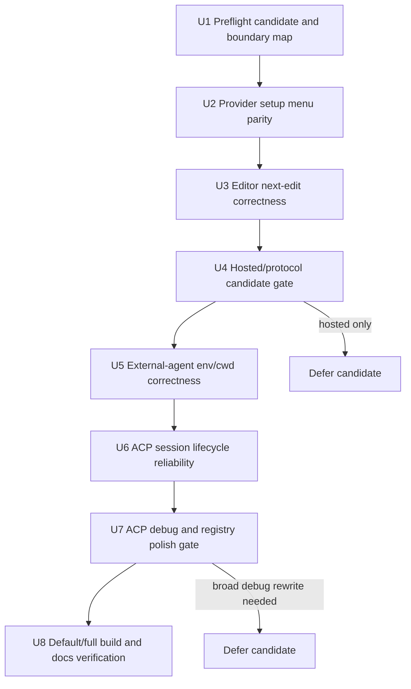

# Backport Zed 1.0 Next-Edit and ACP Polish

## Overview

Selectively backport Zed 1.0-era next-edit and ACP Registry/external-agent polish into
Superzent without absorbing upstream hosted AI, telemetry, Agent Panel, Threads Sidebar, or broad
agent architecture changes. The work should preserve Superzent's default build as
`lite + acp_tabs + next_edit`, keep next-edit focused on non-Zed-hosted providers, and keep ACP
workflows routed through center-pane external-agent tabs.

This is not a full upstream sync. It is a commit/PR-level parity pass for the two surfaces that are
already core to Superzent: default-build next-edit and external ACP agents.

---

## Problem Frame

Zed 1.0 makes edit prediction and agent workflows first-class product surfaces. Superzent already
has its own product split: next-edit is in the default build, while hosted AI and broader upstream
agent surfaces remain outside the default experience. The useful sync opportunity is therefore not
to import Zed's hosted AI model. It is to pull in the correctness fixes, provider setup polish, and
external-agent reliability work that make Superzent's existing default surfaces feel current.

The current repo already includes:

- default feature split in `crates/zed/Cargo.toml`, with `default = ["lite", "acp_tabs",
  "next_edit"]`
- build-aware edit prediction provider policy in `crates/edit_prediction_ui/src/provider_policy.rs`
- default-build edit prediction registry tests in `crates/zed/src/zed/edit_prediction_registry.rs`
- center-pane ACP tab support and external-agent UI under `crates/agent_ui`
- ACP process/session wiring under `crates/agent_servers`
- registry/external-agent environment wiring under `crates/project/src/agent_server_store.rs`
- local ACP debugging surface under `crates/acp_tools`

The main risk is accidental product drift: some upstream commits near the desired fixes assume
Zed-hosted providers, docked agent panels, native text threads, or newer ACP debug-view architecture.
Every accepted change needs a Superzent boundary review before conflict resolution.

---

## Requirements Trace

- R1. Use upstream commit or PR-level cherry-picks only; do not merge all of `upstream/main`.
- R2. Start with the listed next-edit and ACP/external-agent candidates before broadening scope.
- R3. Preserve Superzent's `lite + acp_tabs + next_edit` default build and `full` split.
- R4. Do not add upstream docked Agent Panel, native text threads, Threads Sidebar, hosted Zed Agent,
  cloud collaboration, calls, DeltaDB, or Zeta telemetry to the default build.
- R5. Keep default-build next-edit centered on non-Zed-hosted providers.
- R6. Improve provider setup/status entry points for Copilot, Codestral, and other supported
  non-Zed-hosted providers.
- R7. Backport next-edit correctness fixes that affect prediction preview, cursor movement,
  completions, menus, or subtle mode.
- R8. Only accept provider protocol/model updates when they improve supported providers without
  exposing hosted Zed providers in the default build.
- R9. Treat stale Zed-hosted provider settings in the default build as unsupported or unconfigured.
- R10. Keep ACP Registry work limited to external ACP agents that users can install, update, debug,
  or configure locally.
- R11. Preserve center-pane ACP tab behavior for open, resume, and failure flows.
- R12. Ensure external-agent execution context uses the active project/workspace rather than an
  unrelated home-directory default when project context exists.
- R13. Keep logging/debugging local; do not introduce telemetry.
- R14. Preserve or improve ACP resume/history behavior only when it does not require the Threads
  Sidebar or native text-thread architecture.
- R15. Skip Zed-hosted Agent, Parallel Agents, Zeta telemetry, Business plan, collaboration, calls,
  and DeltaDB changes in this phase.

---

## Scope Boundaries

- Do not import Zed-hosted Agent, Parallel Agents, native text threads, Threads Sidebar, or the
  docked upstream Agent Panel as default-build surfaces.
- Do not enable Zed-hosted/Zeta edit prediction in the default build.
- Do not perform a broad OpenAI-compatible provider protocol migration unless it is proven necessary
  for a supported next-edit provider in this phase.
- Do not rewrite ACP Registry as a marketplace or redesign its information architecture.
- Do not rewrite ACP SDK/process/session architecture beyond what the accepted fixes require.
- Do not edit `.rules` or policy files as part of the implementation. If a non-obvious recurring
  pattern is discovered, propose it under "Suggested .rules additions" in the PR body.

### Deferred to Separate Tasks

- Broad ACP debug-view modernization if `73127da4b7` requires upstream's newer log-tap architecture
  wholesale.
- OpenAI Responses API adoption for general language model providers.
- Zed-hosted provider copy, pricing, telemetry, and account flows.
- Parallel-agent orchestration and native text-thread history import fixes.

---

## Context & Research

### Relevant Code and Patterns

- `crates/zed/Cargo.toml` already defines Superzent's default/full build split. Any feature-gate
  changes must preserve default `next_edit` isolation from hosted AI/chat.
- `crates/edit_prediction_ui/src/provider_policy.rs` centralizes supported provider policy and
  already normalizes unsupported Zed-hosted providers to `None` when the hosted feature is disabled.
- `crates/zed/src/zed/edit_prediction_registry.rs` already imports that provider policy and has
  tests around supported provider assignment and stale provider configuration.
- `crates/edit_prediction_ui/src/edit_prediction_button.rs` already has a common provider menu, but
  upstream's Zed 1.0-era provider setup polish adds better `Configure Providers` entry points for
  Copilot and Codestral menus.
- `crates/editor/src/editor.rs` and `crates/editor/src/edit_prediction_tests.rs` are the main
  surfaces for prediction preview, completions-menu, code-action-menu, and subtle-mode behavior.
- `crates/agent_servers/src/acp.rs` currently opens ACP sessions without upstream's newer pending
  session/ref-count handling, so replay/load/close concurrency fixes need manual adaptation.
- `crates/agent_ui/src/conversation_view.rs` and `crates/agent_ui/src/agent_panel.rs` own the
  center-pane external-agent conversation state that must survive load errors and process exits.
- `crates/project/src/agent_server_store.rs` currently prepares local registry/custom agent
  environments using a home-directory fallback in paths where project context should be preferred.
- `crates/acp_tools/src/acp_tools.rs` has an older active-connection debug surface. Upstream ACP log
  ring work may require a smaller Superzent-specific adaptation rather than a direct import.

### Institutional Learnings

- `docs/solutions/integration-issues/default-build-next-edit-surface-restoration-2026-04-05.md`:
  keep next-edit separate from hosted AI/chat boot, centralize provider policy, preserve setup-list
  vs runtime-available-list separation, and normalize stale `provider: "zed"` outside full builds.
- `docs/solutions/best-practices/gpui-window-reborrow-and-cross-workspace-item-transfer-2026-04-21.md`:
  avoid `WindowHandle::*` re-borrows from render/action paths; center-pane ACP UI changes should use
  existing GPUI entity/window patterns and weak handles where async work crosses windows.
- Existing upstream-sync plans in `docs/plans/` use wave-based candidate acceptance with explicit
  defer gates. This plan follows that pattern because several Zed 1.0 candidates are useful only if
  they can be adapted without broad product drift.

### Upstream Candidate Notes

Active next-edit candidates:

- `a7ca17fcb2` edit_prediction_ui: Add configure providers menu item to Copilot and Codestral
  (#53691)
- `7a6a95c2cd` editor: Fix edit predictions polluting completions menu (#50403)
- `8b822f9e10` Fix regression preventing new predictions from being previewed in subtle mode
  (#51887)
- `db7bc734e2` Fix ep preview closing menus (#54194)

Active ACP/external-agent candidates:

- `f7ab907216` Fix agent servers loading environment from home dir instead of project dir (#52763)
- `2ca94a6032` acp: Register ACP sessions before load replay (#54431)
- `102805a73f` agent_ui: Preserve session resume state after load errors (#54411)
- `a5e78b02de` Fix double borrow panic when ACP process dies (#54135)
- `73127da4b7` acp_tools: Always capture ACP transport and stderr into the log ring (#54536)

Evaluate/defer candidates:

- `2460a5c5df` ep: Fix moving cursor to a predicted position (#55079), because it primarily touches
  hosted Zeta/V3 response handling.
- `57e01b3701` and `f051447a8d`, because they are hosted-model/provider-protocol changes with
  broader language model blast radius.
- `6e900b43ec` and `c91b917383`, because their upstream target file is absent in the current
  Superzent tree and the behavior appears superseded or differently located.
- `1c1b03c3d6`, `07e9a2d25a`, `d1177dc43`, `8f0826f543`, `3ee2f5b811`, and `809e701163`, because
  they may be useful follow-ups but touch broader ACP debug, runtime, auth, registry UI, or project
  surfaces than the core phase requires.

### External References

- Zed 1.0 announcement: `https://zed.dev/blog/zed-1-0`
- ACP Registry announcement: `https://zed.dev/blog/acp-registry`
- Parallel Agents announcement: `https://zed.dev/blog/parallel-agents` (exclusion context only)

---

## Key Technical Decisions

- **Next-edit first, ACP second.** Land next-edit provider UX and editor correctness before ACP
  reliability work because next-edit is already in the default build and has narrower focused test
  surfaces.
- **Provider policy remains centralized.** Any provider-list or runtime-assignment change must go
  through the existing provider policy split rather than reintroducing local ad hoc filtering.
- **Editor correctness fixes are accepted when provider-neutral.** Completions-menu, code-action
  menu, subtle-preview, keymap, and preview cleanup fixes should apply to the editor surface without
  depending on hosted Zed providers.
- **Hosted/provider-protocol commits require a default-build gate.** If a candidate's user-visible
  value only exists for Zeta, hosted models, telemetry, or cloud language model surfaces, defer it.
- **External-agent environment must prefer project context.** Registry/custom/npx/archive agents
  should launch with active project/workspace environment when available, preserving existing
  fallback behavior only when project context cannot be derived.
- **ACP session reliability should adapt, not transplant, newer upstream architecture.** Import the
  behavior around pending load sessions, resume-state preservation, and process-death failure
  reporting while keeping Superzent's center-pane ACP tab model.
- **ACP logging is a gated trial.** Capture transport and stderr into local bounded logs if it can
  be done without a broad debug-view rewrite; otherwise document it as follow-up.

---

## Open Questions

### Resolved During Planning

- **Should this start with Zed 1.0's edit prediction/ACP polish or larger upstream agent features?**
  Start with next-edit and ACP polish only.
- **Should the phase include Zed-hosted Agent, Zeta telemetry, or Parallel Agents?** No. These are
  out of scope for the default build.
- **Should ACP Registry polish be treated as a new product surface?** No. It should validate and
  improve the existing external-agent install/update/debug path.
- **Should `73127da4b7` be mandatory?** No. It is accepted only if it can be adapted without pulling
  a broad ACP debug-view rewrite.

### Deferred to Implementation

- Which upstream commits cherry-pick cleanly versus require manual adaptation.
- Whether `2460a5c5df` has any provider-neutral value for Superzent after hosted Zeta paths are
  excluded.
- Whether ACP log-ring support can be implemented as a small local capture layer over the current
  `acp_tools` surface.
- Whether any registry version-notification or registry-website polish is low-risk enough to include
  after the core ACP reliability fixes land.

---

## High-Level Technical Design

> This diagram is directional guidance for execution review. It is not an implementation recipe.

---

## Implementation Units

- U1. **Preflight candidate map and Superzent boundary gates**

  **Goal:** Establish the accepted, deferred, and trial candidate set before any code change lands.

  **Requirements:** R1, R2, R3, R4, R8, R15

  **Dependencies:** None

  **Files:**

  - Read: `docs/brainstorms/2026-05-03-zed-1-0-next-edit-acp-registry-sync-requirements.md`
  - Read: `README.md`
  - Read: `crates/zed/Cargo.toml`
  - Read: `docs/solutions/integration-issues/default-build-next-edit-surface-restoration-2026-04-05.md`
  - Read: `docs/solutions/best-practices/gpui-window-reborrow-and-cross-workspace-item-transfer-2026-04-21.md`

  **Approach:**

  - Confirm worktree state and record any pre-existing unrelated changes before code edits.
  - For each candidate commit, inspect the upstream file list before applying it.
  - Classify candidates as accepted, adapted, already-present, superseded, or deferred.
  - Stop and reclassify any candidate that unexpectedly touches hosted AI, Agent Panel, Threads
    Sidebar, cloud/collab/calls, or broad language model infrastructure.

  **Patterns to follow:**

  - Existing upstream-sync wave planning in
    `docs/plans/2026-04-23-001-feat-upstream-editor-search-sync-plan.md`
  - Default-build provider policy learning in
    `docs/solutions/integration-issues/default-build-next-edit-surface-restoration-2026-04-05.md`

  **Test scenarios:**

  - No behavioral tests are expected for this unit; it is a preflight and classification unit.

  **Verification:**

  - Candidate order, accepted/deferred classification, and Superzent-specific hard gates are visible
    in execution notes or the PR body before implementation proceeds.

- U2. **Backport next-edit provider setup menu parity**

  **Goal:** Improve provider discovery and setup entry points for supported non-Zed-hosted
  next-edit providers.

  **Requirements:** R5, R6, R8, R9

  **Dependencies:** U1

  **Candidate order:**

  - `a7ca17fcb2` edit_prediction_ui: Add configure providers menu item to Copilot and Codestral
    (#53691)

  **Files:**

  - Modify: `crates/edit_prediction_ui/src/edit_prediction_button.rs`
  - Test: `crates/edit_prediction_ui/src/edit_prediction_button.rs` or the nearest existing UI/menu
    coverage if this module has no practical component test harness

  **Approach:**

  - Adapt upstream's provider-menu entry point polish to the current Superzent
    `edit_prediction_button` structure.
  - Keep the existing provider policy split as the source of truth for whether Zed-hosted providers
    are visible.
  - Ensure Copilot and Codestral menus include a clear path to provider configuration without
    surfacing hosted Zed provider options in the default build.
  - Preserve full-build hosted-provider behavior where it is already feature-gated.

  **Patterns to follow:**

  - Existing provider menu construction in `crates/edit_prediction_ui/src/edit_prediction_button.rs`
  - Existing provider filtering in `crates/edit_prediction_ui/src/provider_policy.rs`

  **Test scenarios:**

  - Happy path: Copilot and Codestral provider menus expose provider configuration from the default
    build.
  - Edge case: default-build provider menus do not expose Zed-hosted provider setup.
  - Edge case: stale `provider: "zed"` settings still route users toward supported provider setup
    rather than an unusable hosted state.
  - Integration: full builds keep any existing hosted-provider feature-gated behavior.

  **Verification:**

  - Provider setup entry points exist for supported providers in default builds.
  - Provider lists and runtime availability still agree with the central provider policy.

- U3. **Backport editor next-edit menu and preview correctness**

  **Goal:** Fix editor-level next-edit regressions around completions menus, code-action menus,
  subtle preview mode, and preview keybindings.

  **Requirements:** R5, R7, R9

  **Dependencies:** U1, U2

  **Candidate order:**

  - `7a6a95c2cd` editor: Fix edit predictions polluting completions menu (#50403)
  - `8b822f9e10` Fix regression preventing new predictions from being previewed in subtle mode
    (#51887)
  - `db7bc734e2` Fix ep preview closing menus (#54194)

  **Files:**

  - Modify: `crates/editor/src/editor.rs`
  - Modify: `crates/editor/src/edit_prediction_tests.rs`
  - Modify: `assets/keymaps/default-linux.json`
  - Modify: `assets/keymaps/default-macos.json`
  - Modify: `assets/keymaps/default-windows.json`
  - Modify: `assets/keymaps/vim.json`
  - Test: `crates/editor/src/edit_prediction_tests.rs`

  **Approach:**

  - Apply or manually adapt the editor fixes in dependency order so preview/keymap behavior is
    tested against the current editor state.
  - Preserve current editor action contexts and Superzent keymap behavior while adapting upstream's
    subtle-preview and accept-keybinding changes.
  - Treat prediction preview behavior as provider-neutral editor behavior, not hosted-provider
    behavior.
  - Add focused coverage for the specific menu and preview regressions rather than broad editor
    refactors.

  **Patterns to follow:**

  - Existing edit prediction tests in `crates/editor/src/edit_prediction_tests.rs`
  - GPUI test timer guidance from `AGENTS.md` when async timing or delayed preview behavior is
    involved

  **Test scenarios:**

  - Happy path: hidden edit predictions no longer open or pollute snippet/completions menus for
    weak single-word input.
  - Happy path: strong snippet-prefix matches still open the intended snippet/completions menu.
  - Edge case: new predictions arriving while subtle-preview modifiers are held become visible.
  - Edge case: edit prediction preview does not close code-action menus.
  - Edge case: completions menus may still be superseded where that is the intended editor
    behavior.
  - Integration: default keymaps keep accept/preview behavior aligned with eager versus subtle edit
    prediction modes.

  **Verification:**

  - Focused editor edit-prediction tests cover each imported correctness fix.
  - Keymap changes compile and do not reintroduce hosted-provider assumptions.

- U4. **Gate hosted/provider-protocol candidates against default-build policy**

  **Goal:** Evaluate nearby upstream provider changes without accidentally importing hosted Zed or
  broad language model behavior into the default build.

  **Requirements:** R3, R5, R8, R9, R15

  **Dependencies:** U1, U2, U3

  **Candidate order:**

  - Evaluate: `2460a5c5df` ep: Fix moving cursor to a predicted position (#55079)
  - Defer by default: `57e01b3701` hosted-model copy changes
  - Defer by default: `f051447a8d` OpenAI Responses API provider migration

  **Files:**

  - Inspect: `crates/cloud_llm_client/src/predict_edits_v3.rs`
  - Inspect: `crates/edit_prediction/src/zeta.rs`
  - Inspect: `crates/edit_prediction/src/edit_prediction_tests.rs`
  - Inspect: `crates/language_models/src/provider/cloud.rs`
  - Inspect: `crates/language_models/src/provider/open_ai.rs`
  - Inspect: `crates/open_ai/src/open_ai.rs`
  - Inspect: `crates/edit_prediction_ui/src/provider_policy.rs`
  - Inspect: `crates/zed/src/zed/edit_prediction_registry.rs`

  **Approach:**

  - Treat `2460a5c5df` as accepted only if the cursor-position behavior benefits a supported,
    default-build provider path without exposing hosted Zeta in UI or runtime.
  - Keep hosted-model copy changes out of scope unless current default-build UI exposes misleading
    hosted-provider copy.
  - Keep OpenAI Responses API migration out of scope unless a supported next-edit provider is
    broken without it.
  - Record the decision for each candidate in execution notes or the PR body so future sync passes
    know whether it was skipped, superseded, or intentionally deferred.

  **Patterns to follow:**

  - Provider policy boundary in `crates/edit_prediction_ui/src/provider_policy.rs`
  - Default-build registry tests in `crates/zed/src/zed/edit_prediction_registry.rs`

  **Test scenarios:**

  - If accepted: cursor placement tests cover the provider-neutral behavior without requiring hosted
    Zeta in the default build.
  - If deferred: no new behavior tests are required, but the defer reason is recorded.
  - Regression: default build still normalizes unsupported hosted provider settings to
    unconfigured.

  **Verification:**

  - Default-build provider policy remains intact after evaluating hosted/provider-protocol
    candidates.
  - No hosted provider surface appears in default-build setup, status, or runtime paths.

- U5. **Backport external-agent environment and cwd correctness**

  **Goal:** Launch external ACP agents with the active project/workspace environment when project
  context exists.

  **Requirements:** R10, R12, R13

  **Dependencies:** U1

  **Candidate order:**

  - `f7ab907216` Fix agent servers loading environment from home dir instead of project dir (#52763)
  - Evaluate after core fix: `07e9a2d25a` node runtime/npm registry launch polish

  **Files:**

  - Modify: `crates/project/src/environment.rs`
  - Modify: `crates/project/src/agent_server_store.rs`
  - Test: `crates/project/src/environment.rs`
  - Test: `crates/project/src/agent_server_store.rs` or the nearest existing project integration
    tests for extension/external agents
  - Optional: `crates/node_runtime/src/node_runtime.rs` if the npm launch polish is accepted

  **Approach:**

  - Add or adapt a project-default environment lookup that prefers the active visible worktree or
    equivalent project context.
  - Replace home-directory environment loading for local registry, archive, custom, and npx ACP
    agents where project context is available.
  - Preserve existing environment merge precedence and fallback behavior when no project worktree is
    available.
  - Evaluate npm/node runtime polish only after the project-context fix is stable, and defer it if
    it broadens into unrelated node runtime behavior.

  **Patterns to follow:**

  - Existing `ProjectEnvironment` lookup methods in `crates/project/src/environment.rs`
  - Existing local registry/custom agent launch paths in `crates/project/src/agent_server_store.rs`

  **Test scenarios:**

  - Happy path: a local registry/custom/npx ACP agent launched from a project uses that project's
    environment.
  - Edge case: no visible project worktree falls back to existing safe behavior.
  - Edge case: extra environment variables and agent-specific settings keep their expected
    precedence.
  - Integration: center-pane ACP agent launch observes project environment without requiring Agent
    Panel.

  **Verification:**

  - External agents no longer load from home-directory environment when project context exists.
  - ACP launch remains local and does not introduce telemetry or hosted service dependencies.

- U6. **Backport ACP session lifecycle reliability**

  **Goal:** Make ACP session load, replay, retry, and process-death paths reliable in center-pane
  external-agent tabs.

  **Requirements:** R10, R11, R13, R14

  **Dependencies:** U1, U5

  **Candidate order:**

  - `2ca94a6032` acp: Register ACP sessions before load replay (#54431)
  - `102805a73f` agent_ui: Preserve session resume state after load errors (#54411)
  - `a5e78b02de` Fix double borrow panic when ACP process dies (#54135)

  **Files:**

  - Modify: `crates/agent_servers/src/acp.rs`
  - Modify: `crates/agent_servers/src/agent_servers.rs`
  - Modify: `crates/agent_servers/Cargo.toml`
  - Modify: `crates/agent_ui/src/agent_panel.rs`
  - Modify: `crates/agent_ui/src/conversation_view.rs`
  - Modify: `crates/agent_ui/Cargo.toml`
  - Modify: `Cargo.lock`
  - Test: `crates/agent_servers/src/acp.rs`
  - Test: `crates/agent_ui/src/conversation_view.rs`

  **Approach:**

  - Adapt upstream's pending-session and replay-order behavior to Superzent's current ACP connection
    types.
  - Preserve session resume metadata across load failures so retrying a failed external-agent tab
    resumes the intended session instead of creating a new one.
  - Convert ACP process death into visible load/failure state without double-borrow panics.
  - Keep the UI path aligned with center-pane ACP tabs and avoid making the docked Agent Panel a new
    default-build dependency.
  - Review new test dependencies carefully; accept them only when they are limited to test support
    or necessary fake ACP server coverage.

  **Patterns to follow:**

  - Existing ACP session storage in `crates/agent_servers/src/acp.rs`
  - Existing center-pane conversation tests in `crates/agent_ui/src/conversation_view.rs`
  - GPUI entity update rules from `AGENTS.md`, especially avoiding nested updates on the same entity

  **Test scenarios:**

  - Happy path: replay notifications that arrive before load completion are retained and displayed.
  - Edge case: concurrent load attempts for the same ACP session do not create duplicate sessions or
    lose replayed updates.
  - Edge case: closing a tab while load is in flight does not orphan an ACP session.
  - Edge case: retrying after a load error preserves original session metadata and resumes the
    intended session.
  - Edge case: ACP server process exit transitions the view into a visible failure state without a
    panic.

  **Verification:**

  - ACP session lifecycle tests cover replay, close-during-load, retry-after-load-error, and
    process-death behavior.
  - Center-pane ACP tab open/resume/failure flows work without enabling upstream native text
    threads or docked Agent Panel behavior.

- U7. **Trial ACP debug logging and small registry polish**

  **Goal:** Improve local debugging for external ACP agents and include only low-risk registry polish
  that fits current Superzent architecture.

  **Requirements:** R10, R11, R13, R14, R15

  **Dependencies:** U1, U5, U6

  **Candidate order:**

  - Trial: `73127da4b7` acp_tools: Always capture ACP transport and stderr into the log ring (#54536)
  - Evaluate only if needed for the trial: `1c1b03c3d6` ACP debug view modernization
  - Optional low-risk polish: `3ee2f5b811` registry websites page
  - Optional low-risk polish: `809e701163` registry new-version notification polish
  - Superseded/defer: `6e900b43ec`, `c91b917383`, `d1177dc43`, `8f0826f543`

  **Files:**

  - Modify: `crates/acp_tools/src/acp_tools.rs`
  - Modify: `crates/acp_tools/Cargo.toml`
  - Modify: `crates/agent_servers/src/acp.rs`
  - Modify: `crates/agent_servers/src/agent_servers.rs`
  - Modify: `crates/agent_servers/Cargo.toml`
  - Optional: `crates/agent_ui/src/agent_connection_store.rs`
  - Optional: `crates/agent_ui/src/agent_registry_ui.rs`
  - Optional: `crates/project/src/agent_registry_store.rs`
  - Optional: `crates/project/src/agent_server_store.rs`
  - Test: `crates/acp_tools/src/acp_tools.rs`
  - Test: nearest existing registry/external-agent UI or project integration coverage

  **Approach:**

  - First determine whether transport/stderr capture can be layered onto the current
    `AcpConnectionRegistry` and debug surface without importing the entire newer debug-view model.
  - If feasible, capture ACP transport and process stderr into a bounded local log buffer that is
    available even when the log view is opened after the failure.
  - Keep logging local to the user's machine and avoid telemetry or remote reporting.
  - Accept registry website/version polish only if it does not require broader registry store or UI
    migrations.
  - Record explicit defer reasons for thread-import, terminal-auth, and broad agent cwd candidates
    when they do not fit the current tree or phase scope.

  **Patterns to follow:**

  - Current ACP debug surface in `crates/acp_tools/src/acp_tools.rs`
  - Local-only logging requirement from the brainstorm requirements
  - Existing registry UI/store patterns in `crates/agent_ui` and `crates/project`

  **Test scenarios:**

  - Happy path: ACP transport messages emitted before opening the logs view are still available.
  - Happy path: ACP process stderr is captured in local debug logs.
  - Edge case: the log buffer is bounded and does not grow without limit.
  - Edge case: opening a new active ACP connection clears or scopes logs so stale logs are not
    confused with the current connection.
  - Optional: registry website/version polish is covered only if those candidates are accepted.

  **Verification:**

  - Debug logs help diagnose external-agent startup and transport failures without telemetry.
  - Any candidate that requires a broad ACP debug-view rewrite is deferred rather than forced into
    this phase.

- U8. **Final default/full build verification and documentation updates**

  **Goal:** Confirm the accepted backports preserve Superzent's feature split and update user-facing
  docs only where behavior actually changed.

  **Requirements:** R3, R4, R5, R10, R11, R13, R15

  **Dependencies:** U2, U3, U4, U5, U6, U7

  **Files:**

  - Verify: `crates/zed/Cargo.toml`
  - Verify: `README.md`
  - Optional docs: `docs/src/ai/edit-prediction.md`
  - Optional docs: `docs/src/ai/external-agents.md`
  - Optional docs: `docs/src/extensions/agent-servers.md`
  - Optional docs: `docs/src/getting-started.md`
  - Optional docs: `docs/src/development.md`

  **Approach:**

  - Confirm default and full feature sets still compile after accepted next-edit and ACP changes.
  - Run focused next-edit, ACP session, external-agent environment, and ACP debug tests that match
    accepted candidates.
  - Update docs only if user-visible behavior or setup paths changed. Follow `docs/AGENTS.md` for
    any `docs/src` edits.
  - In the PR body, summarize accepted, adapted, already-present, and deferred upstream candidates.
  - Include release notes that describe user-facing next-edit/provider or external-agent reliability
    improvements, or `N/A` if the final diff is purely internal.

  **Patterns to follow:**

  - Pull request hygiene from `AGENTS.md`
  - Existing docs tone and scope under `docs/src`

  **Test scenarios:**

  - Integration: default build includes next-edit and ACP tabs without hosted AI/chat surfaces.
  - Integration: full build still compiles with hosted/full-only behavior available behind its
    existing feature gates.
  - Regression: editor next-edit tests, ACP session tests, and external-agent environment tests pass
    together.
  - Documentation: any changed setup path is reflected in docs without describing out-of-scope Zed
    hosted surfaces as supported defaults.

  **Verification:**

  - Default/full build feature split is unchanged in intent.
  - Focused tests pass for all accepted candidates.
  - Documentation and PR notes clearly separate accepted backports from deferred upstream features.

---

## System-Wide Impact

- **Feature gates:** Default build remains `lite + acp_tabs + next_edit`; full remains the place for
  broader upstream AI/collab behavior.
- **Provider policy:** `provider_policy.rs` remains the authority for default-build edit prediction
  provider support.
- **Editor behavior:** Prediction preview, completions menus, and keymaps change in editor-global
  code, so focused regression tests are required even though the feature is next-edit-specific.
- **Project environment:** External-agent launch paths may now observe project environment more
  accurately, affecting custom, registry, archive, and npx ACP agents.
- **ACP sessions:** Session load/replay/failure semantics become more explicit and may add test-only
  fake server support.
- **Debug logs:** If accepted, ACP logs become buffered locally before the debug view opens; this
  should improve diagnosis without creating telemetry.

---

## Risks and Mitigations

- **Risk: upstream commits assume newer agent UI or ACP abstractions.**
  Mitigation: inspect file lists first, adapt behavior to current Superzent center-pane ACP flow, and
  defer candidates that require broad architecture import.
- **Risk: hosted-provider changes leak into the default build.**
  Mitigation: run all provider changes through the existing provider policy and verify default-build
  provider lists exclude hosted Zed paths.
- **Risk: keymap changes alter general editor behavior.**
  Mitigation: keep keymap edits tied to edit prediction mode contexts and cover eager/subtle preview
  behavior in focused editor tests.
- **Risk: ACP session lifecycle fixes introduce entity reborrow or nested-update bugs.**
  Mitigation: follow GPUI entity/window rules, add fake-server tests for process death and load
  errors, and avoid nested updates on the same entity.
- **Risk: ACP logging trial expands into a debug-view rewrite.**
  Mitigation: make `73127da4b7` a gated trial and document a defer decision if a minimal adaptation
  is not viable.
- **Risk: project environment changes affect unrelated agent launch flows.**
  Mitigation: preserve fallback behavior and test project-context, no-project, and extra-env
  precedence cases.

---

## Verification Strategy

- Focused next-edit provider menu coverage confirms provider setup entry points and provider policy
  remain aligned.
- Focused editor edit-prediction tests cover completions-menu pollution, subtle preview, code-action
  menu preservation, and keymap mode behavior.
- Focused project/external-agent environment tests cover project-context environment selection and
  fallback behavior.
- Focused ACP session tests cover replay-before-load, concurrent load, close-during-load,
  retry-after-load-error, and ACP process exit.
- ACP debug tests cover local transport/stderr capture if the log-ring trial is accepted.
- Default and full build checks confirm feature-gate boundaries still compile.
- Project clippy verification should use `./script/clippy` rather than raw `cargo clippy`.

---

## Documentation and PR Notes

- Update docs only for user-visible provider setup, external-agent environment, registry, or local
  ACP debugging behavior that changes.
- If docs under `docs/src` are edited, follow `docs/AGENTS.md` and format them with the docs
  Prettier workflow.
- In the PR body, include a short accepted/deferred candidate table so reviewers can see why hosted
  Zed Agent, Zeta, provider protocol, or broader ACP architecture commits were not imported.
- If a non-obvious repeatable rule emerges during execution, propose it under a "Suggested .rules
  additions" heading in the PR body rather than editing policy files directly.

---

## Sources and References

- Origin requirements:
  `docs/brainstorms/2026-05-03-zed-1-0-next-edit-acp-registry-sync-requirements.md`
- Related plan:
  `docs/plans/2026-04-05-001-feat-default-build-next-edit-plan.md`
- Related plan:
  `docs/plans/2026-04-23-001-feat-upstream-editor-search-sync-plan.md`
- Default-build next-edit learning:
  `docs/solutions/integration-issues/default-build-next-edit-surface-restoration-2026-04-05.md`
- GPUI/window learning:
  `docs/solutions/best-practices/gpui-window-reborrow-and-cross-workspace-item-transfer-2026-04-21.md`
- Product/build context: `README.md`
- Zed 1.0 announcement: `https://zed.dev/blog/zed-1-0`
- ACP Registry announcement: `https://zed.dev/blog/acp-registry`
- Parallel Agents announcement: `https://zed.dev/blog/parallel-agents`
